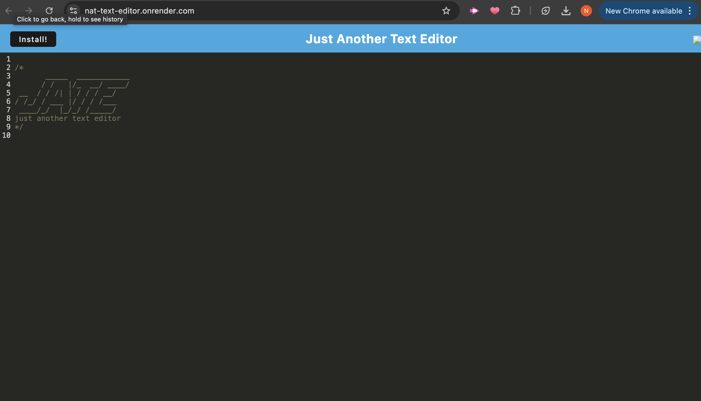

# nat-text-editor

# PWA Text Editor

## Description
A simple text editor that neets the PWA criteria. 

## Table of Contents
- [Installation](#installation)
- [Usage](#usage)
- [Contribution Guidelines](#contribution-guidelines)
- [Test Instructions](#test-instructions)
- [Licenses](#licenses)
- [Questions](#questions)

## Installation
Install dependencies and run the project though the scripts in the package.json file.

## Usage
Open the website either through Render or localhost 3000 and starting typing.

Here is the website on Render - [Link](https://nat-text-editor.onrender.com/)

## Contribution Guidelines
N/A

## Screenshot 

## Test Instructions
N/A

## Licenses
This project uses the following license:
- None

## Questions
If you have any further inquiries then you can contact me at:
- My GitHub: [https://github.com/namastenataly]
    